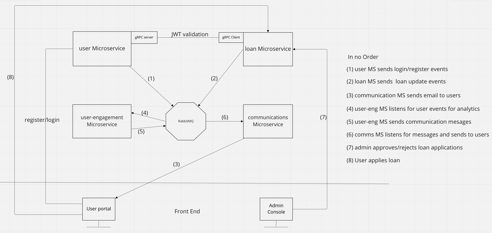

GO Lang MicroService project.

Description:
This is a working project to demo Micrservices using Go Lang. 
- On User side, User registers, Login to apply for loan - sugbmit loan applicatiion, 
- On the Admin side, an admin approves or rejects loan
- User recieves communication via provided email

Tech stack:

	- Golang
	- MongoDB
	- RabbitMQ
	- gRPC
	- Redis
	- Docker
	- Angular
	- goMail

Design Patterns:

	Repository Pattern
	Event driven

Microservcies:

	1) auth
		REST API on 9000, gRPC on 9001 
			- Register, Login, authService (JWT validation via gRPC) for other microserves
		

	2) loan [Apply loan, Query loan status, communicates to auth microservice for JWT validation]
		gRPC on 8000

	
	3) communications
		Listens to RabbitMQ for userCommunication messsages and sends to users(email for now)

	4) user-engagement (*work in progress)
		Listens to RabbitMQ for user activities such as Login, Register, Loan Applied... and runs analytics for example - send loan offers etc

Architecture diagram

